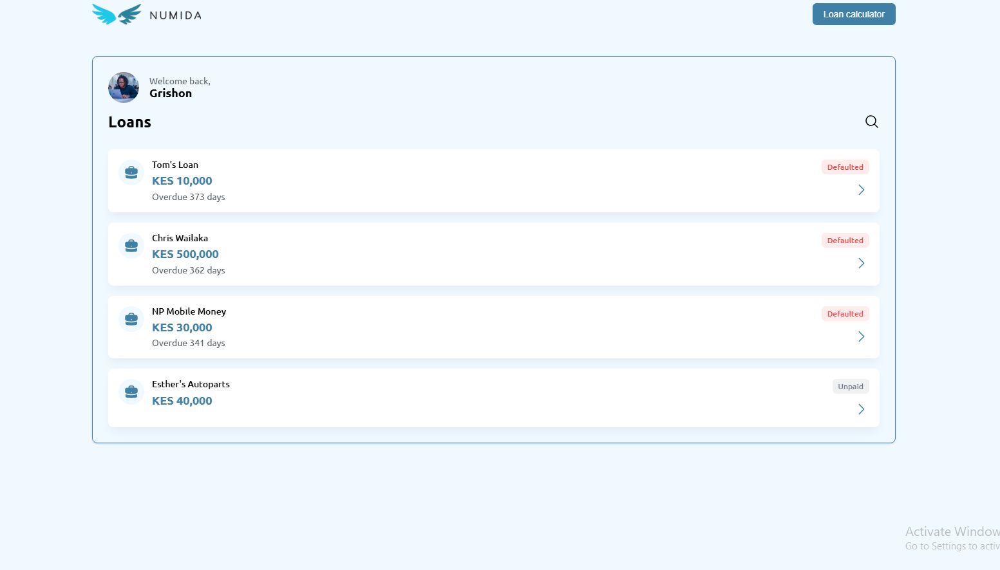
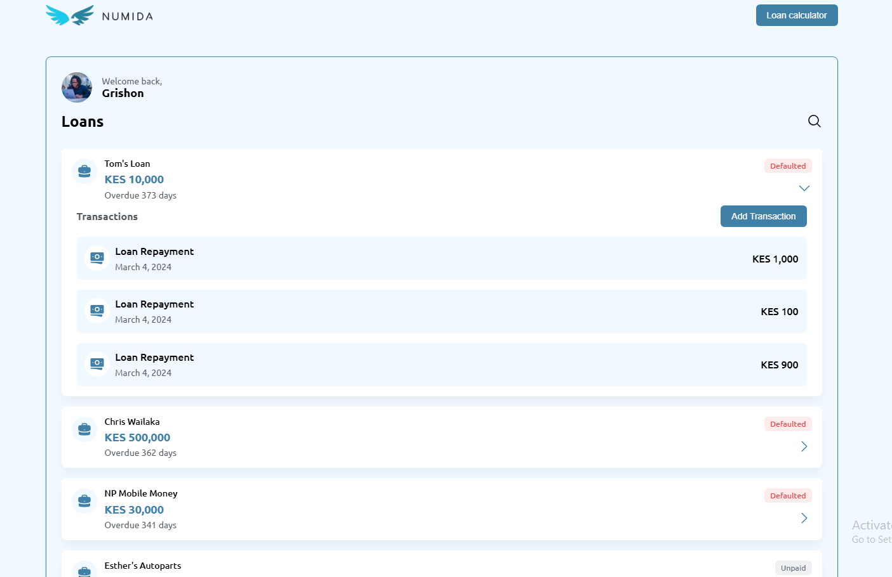
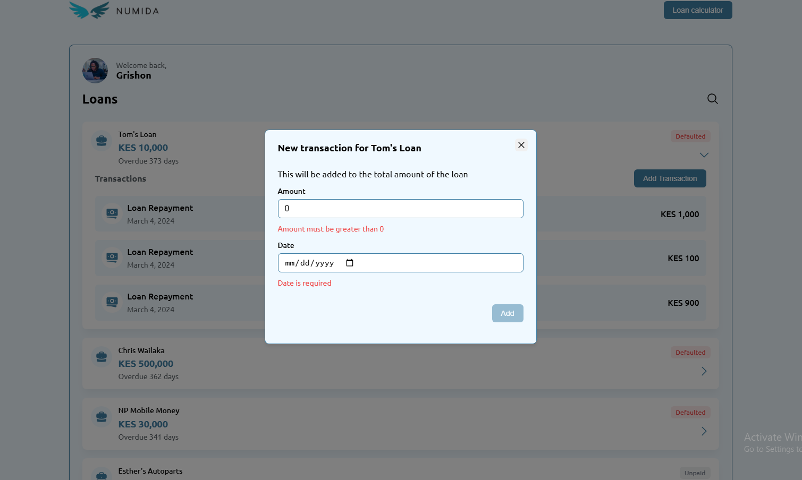
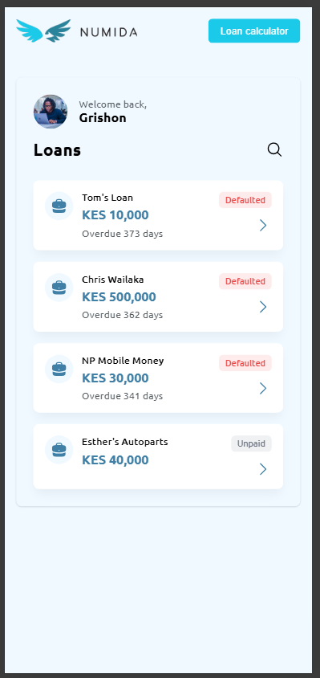
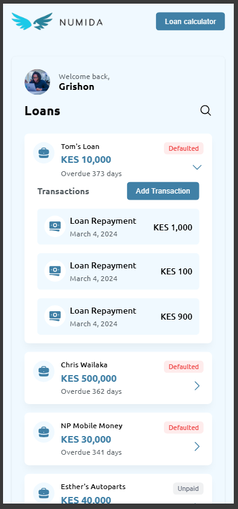
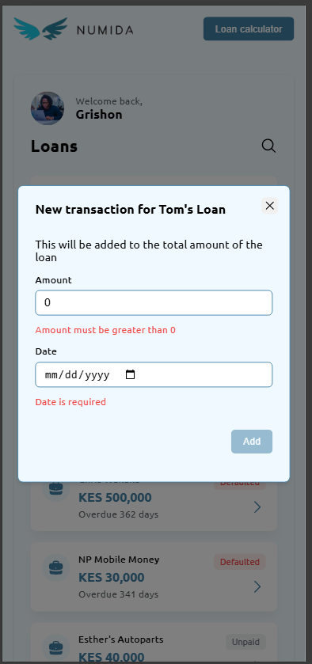
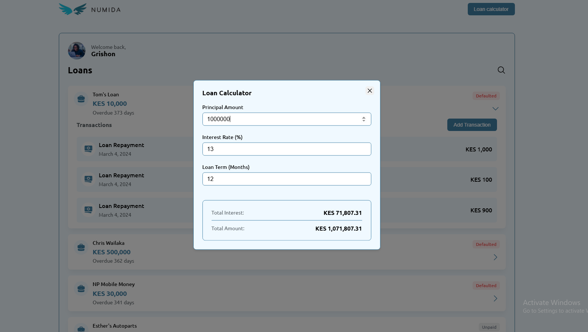
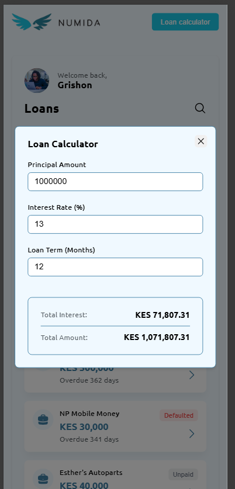

<p align="center">
  
</p>

# Numida Full Stack Assessment Implementation

### TLDR: Watch the [demo here]()

This implementation focuses on creating a loan management system that displays and manages loan statuses effectively. The core functionality revolves around loan payment tracking and status visualization, with an emphasis on clean architecture and user experience.

## Core Requirements Completed

### GraphQL Data Layer

##### GraphQL endpoint at `localhost:2024/graphql`

- Get a list of all loan payments
  Query

  ```graphql
  {
    loanPayments {
      id
      loanId
      paymentDate
    }
  }
  ```

  Sample response

  ```graphql
  {
  "data": {
    "loanPayments": [
      {
        "id": "1",
        "loanId": "1",
        "paymentDate": "2024-03-04"
      },
      ...
      {
        "id": "3",
        "loanId": "3",
        "paymentDate": "2024-04-05"
      }
    ]
  }
  }
  ```

- Get a list of all loans with payments embedded
  Query
  ```graphql
  {
    loans {
      id
      principal
      payments {
        id
        loanId
        paymentDate
        amount
      }
    }
  }
  ```
  Sample response
  ```graphql
  {
  "data": {
    "loans": [
      {
        "id": "1",
        "principal": 10000,
        "payments": [
          {
            "id": "1",
            "loanId": "1",
            "paymentDate": "2024-03-04",
            "amount": 1000
          },
          ...
          {
            "id": "5",
            "loanId": "1",
            "paymentDate": "2024-03-04",
            "amount": 900
          }
        ]
      },
      ...
      {
        "id": "3",
        "principal": 30000,
        "payments": [
          {
            "id": "3",
            "loanId": "3",
            "paymentDate": "2024-04-05",
            "amount": null
          }
        ]
      },
    ]
  }
  }
  ```

### Restful API Data Layer

- RESTful API for creating a new payment for a specific loan
  ```bash
  POST: http://localhost:2024/loans/<loan_id>/payments 
  {
    amount: 100,
    date: "2025-03-13"
  }
  ```

### Frontend Implementation

- Loan and payment data display with status-based styling
- Payment categorization function implemented with status indicators:
  - **On Time** (Green)
  - **Late** (Orange)
  - **Defaulted** (Red)
  - **Unpaid** (Grey)

##### Screenshots
<p align="center">
  
  
  
</p>
<p align="center">
  
  
  
</p>


### Code Refactoring

- Improved `LoanCalculator` component with:
  - Form validation
  - Real-time calculations
  - Error handling

##### Screenshots
<table>
  <tr>
    <td style="padding-right: 20px;"></td>
    <td></td>
  </tr>
</table>

## Additional Implementations
- Added loans search filters
- Implemented error handling for API calls
- Added loading states for better UX
- Added tests for critical components
  ```bash
  npm run test:coverage
  ```

## Areas for Improvement

Given more time, these areas could be enhanced:

#### Authentication and Authorization
- Authenticate users before Read operation and ensure only priviledged users can Update or Delete

#### Data Management
- Implement an actual database for data storage. eg, Postgres or MongoDB
- Complete update and delete functionalities for priviledged users

### User Experience

- Add buttery smooth animations and styles
- Added accessibility features
- Added internationalization support for multi languages and currencies
- Add all CRUD operations according to access rights

### Testing
- Increase test coverage
- Add end-to-end testing


### Thank you
I really had a lot of fun working on this, thank you for the opportunity 💃🏻